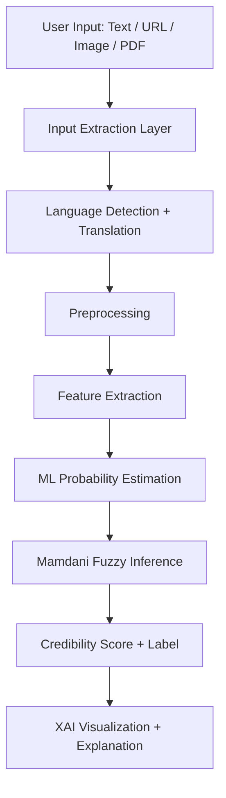
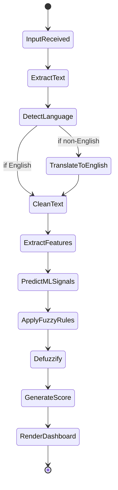

# FINAL REVIEW REPORT OF WORK PROJECT
## Soft Computing (BITE405L)

---

## Title Page (Format Template)

**[Insert VIT Logo at top center]**

**School Name:** School of Computer Science Engineering and Information Systems, VIT Vellore  
**Project Review On:** *Fake News Credibility Assessment using Hybrid Machine Learning and Mamdani Fuzzy Logic*  
**Date of Presentation:** [DD/MM/YYYY]  
**Course Name and Subject Code:** Soft Computing, BITE405L  
**Submitted By:**  
- Lavisha (23BIT0392), Phone: [Insert], Email: [Insert]  
- Ansh Sabharwal (23BIT0212), Phone: [Insert], Email: [Insert]  

**Under the guidance of:**  
Dr. B. K. Tripathy, Professor (HAG), SCORE, VIT, Vellore

---

## Certificate (Optional Institutional Format)

This is to certify that the work titled **"Fake News Credibility Assessment using Hybrid Machine Learning and Mamdani Fuzzy Logic"** submitted by the above students is a bonafide record of project work carried out under guidance for the course **Soft Computing (BITE405L)**.

---

## Acknowledgment

We express our sincere gratitude to **Dr. B. K. Tripathy** for his guidance, technical feedback, and continuous motivation throughout this work project. We also thank the faculty and infrastructure support from the School of Computer Science Engineering and Information Systems, VIT Vellore.  

We acknowledge open-source communities and researchers whose datasets, tools, and literature made this project possible. The project implementation benefited from libraries in natural language processing, machine learning, fuzzy systems, and visualization.  

Finally, we thank peers and evaluators who provided practical suggestions on usability, explainability, and report quality.

---

## Abstract

The rapid spread of misinformation across social media and online news platforms has made credibility assessment a significant computational and social challenge. Most existing automated systems emphasize high classification accuracy but rely on rigid binary outputs (real/fake) and often provide limited interpretability. In real-world situations, however, credibility is rarely binary: many articles are partially factual, contextually biased, sensational in tone, or weak in source quality. This project addresses that gap by developing a hybrid system that combines machine learning with Mamdani fuzzy inference to generate a graded credibility score rather than a hard class label.

The proposed system accepts multimodal inputs in the form of raw text, URLs, images, and PDF files. For URL input, article content and metadata are extracted using an article parser; for image input, text is extracted via OCR with preprocessing for better recognition quality; for PDF input, page-level text extraction is applied. The extracted text is then normalized through language detection and translation to English when required, followed by preprocessing for noise reduction.

A feature engineering layer computes six core credibility signals: emotional intensity, objectivity, source reliability, clickbait probability, content length adequacy, and lexical repetition. Two supervised machine learning pipelines based on TF-IDF and Logistic Regression are used to estimate clickbait and writing formality probabilities. These quantitative features are fed into a Mamdani fuzzy system with linguistic memberships (low, medium, high) and a rule base designed to model expert-style reasoning under uncertainty. The fuzzy engine outputs a final credibility score on a 0-100 scale and a qualitative label (Low/Medium/High).

The project emphasizes explainability through feature-level visualizations, score gauges, and text highlighting that indicates suspicious lexical patterns (clickbait, extreme emotion, repetitive spam). The resulting framework is computationally lightweight, practical for local execution on standard machines, and better aligned with human interpretation compared to purely black-box approaches.  

This work demonstrates that integrating probabilistic ML with fuzzy reasoning can produce interpretable and robust fake-news credibility assessment while remaining scalable and user-centric.

---

## Table of Contents

1. Abstract  
2. Aim and Objectives  
3. Hardware and Software Requirements  
4. Literature Review  
5. Gaps Identified  
6. Problem Framed  
7. Solution Proposed  
8. Architecture of the System  
9. Detailed Description of Modules  
10. Workflow Diagram  
11. Languages and Tools Used  
12. Procedure of the Project (Algorithms)  
13. Dataset Description  
14. Experimental Setup and Execution  
15. Result Analysis  
16. Comparison with Existing Approaches  
17. Sample Code (max 2 pages)  
18. Conclusions  
19. Scope for Future Work  
20. References  
21. Appendix (Recommended for page expansion)

---

## 1. Aim and Objectives

### 1.1 Aim

To design and implement an explainable fake-news credibility assessment system that combines machine learning and fuzzy logic to produce nuanced credibility scoring across multiple input formats.

### 1.2 Objectives

1. Develop a **multimodal ingestion pipeline** supporting text, URL, image, and PDF inputs.  
2. Build a **language handling layer** for language detection and translation to maintain a consistent processing pipeline.  
3. Engineer interpretable features representing emotionality, objectivity, source trust, clickbait tendency, repetition, and content adequacy.  
4. Train lightweight **TF-IDF + Logistic Regression** models for clickbait and formality scoring.  
5. Integrate these features into a **Mamdani fuzzy inference system** for credibility reasoning under uncertainty.  
6. Provide user-level explainability through visual dashboards and highlighted evidence in analyzed text.  
7. Evaluate behavior across reliable, misleading, and ambiguous content categories.  
8. Deliver a practical, CPU-friendly system suitable for academic demonstration and further extension.

### 1.3 Expected Academic Outcomes

- Demonstration of soft-computing concepts in a real application.
- Integration of data-driven and rule-based reasoning.
- Explainability-oriented AI design in an applied misinformation context.

---

## 2. Hardware and Software Requirements

### 2.1 Hardware Requirements

| Component | Minimum Requirement | Recommended |
| --- | --- | --- |
| CPU | Dual-core processor | Intel i5 / Ryzen 5 or above |
| RAM | 8 GB | 16 GB for smoother multitasking |
| Storage | 5 GB free | 10 GB free |
| GPU | Not required | Optional |
| Internet | Required for URL parsing and translation APIs | Stable broadband |

### 2.2 Software Requirements

| Category | Tools/Libraries |
| --- | --- |
| Language | Python 3.9+ |
| Web Interface | Streamlit |
| NLP | TextBlob, NLTK, VADER |
| ML | scikit-learn |
| Fuzzy Logic | scikit-fuzzy |
| OCR & Document | pytesseract, Pillow, pdfplumber |
| URL Article Parsing | newspaper3k |
| Translation | langdetect, deep-translator |
| Visualization | Plotly |
| Data Handling | pandas, pickle |

### 2.3 Environment Setup Summary

1. Install dependencies from `requirements.txt`.  
2. Download NLP resources using `setup_nltk.py`.  
3. Train model artifacts (`train_real_model.py`) to generate `data/clickbait_model.pkl`.  
4. Launch the Streamlit app using `streamlit run app.py`.

---

## 3. Literature Review

### 3.1 Overview

Fake-news detection research evolved from classical lexical-statistical classifiers to deep neural architectures and hybrid explainable systems. While deep models often report high benchmark accuracy, practical deployment still faces limitations in interpretability, cross-domain generalization, and multimodal adaptability.

### 3.2 Representative Studies

| S. No. | Study | Method | Key Contribution | Limitation |
| --- | --- | --- | --- | --- |
| 1 | Shu et al. (2017) | Survey/Data Mining | Structured understanding of fake-news ecosystem | Limited direct deployment strategy |
| 2 | Vosoughi et al. (2018) | Social diffusion analysis | Shows false news spreads faster than true news | Not a direct detector |
| 3 | Wang (2017) LIAR | Benchmark dataset | Fine-grained fact-checking benchmark | Primarily text and political claims |
| 4 | Zhou & Zafarani (2020) | Survey | Formal taxonomy of methods | Highlights many unresolved practical gaps |
| 5 | Kaliyar et al. (2021) | FakeBERT | Strong contextual deep baseline | Less interpretable than rule-driven systems |
| 6 | Castillo et al. (2011) | Credibility on Twitter | Importance of metadata and structure | Platform-specific scope |
| 7 | Fuzzy+DL hybrid papers (2022-2025) | Neuro-fuzzy variants | Good uncertainty handling attempts | Often computationally heavy/complex |

### 3.3 Literature Insights Relevant to This Project

- Credibility requires **multi-factor judgment**, not single-metric classification.
- Interpretability is central for user trust in content moderation systems.
- Hybrid approaches can provide practical middle ground between strict rules and pure black-box learning.
- Lightweight systems are necessary for real-time, resource-constrained environments.

---

## 4. Gaps Identified

Based on the literature and implementation landscape, the following gaps are identified:

1. **Binary decision bias**: Many systems force real/fake labels, ignoring partial credibility.  
2. **Explainability deficit**: User-facing rationale is often weak or absent.  
3. **Format rigidity**: Text-only systems underperform in multimodal real usage.  
4. **Language limitation**: English-centric training and evaluation reduce multilingual applicability.  
5. **Compute overhead**: Deep architectures may be hard to deploy on modest devices.  
6. **Limited practical integration**: Several research systems remain benchmark-focused with low end-user usability.

---

## 5. Problem Framed

How can we design a credible-news assessment framework that:

- accepts diverse news formats (text, URL, image, PDF),
- supports multilingual content through unified preprocessing,
- produces an interpretable **continuous credibility score**,
- combines statistical evidence with human-like uncertain reasoning,
- and remains computationally feasible on standard hardware?

The project frames fake-news assessment as a **soft decision problem** rather than strict classification, where uncertainty, partial truth, and mixed evidence are common.

---

## 6. Solution Proposed

### 6.1 Core Idea

A hybrid **ML + Mamdani fuzzy inference** framework where:

- ML models produce probabilistic indicators,
- fuzzy logic combines indicators using interpretable rules,
- final output is a graded credibility score with explanatory cues.

### 6.2 Proposed Pipeline

1. Input ingestion (text/URL/image/PDF).  
2. Language detection and translation.  
3. Text preprocessing and normalization.  
4. Feature extraction (emotion, objectivity, source, clickbait, length, repetition).  
5. Fuzzy rule evaluation and defuzzification.  
6. Dashboard-based result display and explanation.

### 6.3 Why This Solution

- Balances **accuracy and interpretability**.
- Handles uncertainty better than hard-threshold classifiers.
- Keeps model stack lightweight and explainable.
- Supports demonstration-ready UI and practical educational value.

---

## 7. Architecture of the System

### 7.1 High-Level Architecture



### 7.2 Design Principles

- **Modularity:** each module independently testable.
- **Interoperability:** common text representation before analytics.
- **Explainability-first:** outputs include feature drivers.
- **Robustness:** fallback defaults when model/data signals are uncertain.

### 7.3 Data Flow Notes

- URL extraction yields article metadata (title, author, date, domain).
- Domain metadata is blended with formality prediction to estimate source reliability.
- Fuzzy rules include veto logic to prevent high objectivity from masking high clickbait.

---

## 8. Detailed Description of Modules

### 8.1 Input Acquisition Module (`input_module.py`)

This module standardizes varied sources into analyzable text:

- **Raw text path:** direct ingestion.
- **URL path:** article parser extraction with metadata.
- **Image path:** grayscale + contrast enhancement + OCR (`hin+eng` support with fallback).
- **PDF path:** page-level text extraction.

#### Practical Importance

Real misinformation appears in posters, screenshots, and documents, not only clean text; this module bridges that practical mismatch.

### 8.2 Language Detection and Translation Module (`language.py`)

This module ensures linguistic normalization:

- Detects language using probabilistic detection.
- Uses Devanagari regex fallback to force Hindi recognition when needed.
- Translates non-English input to English in chunks to avoid length and timeout issues.

#### Practical Importance

Enables multilingual operation without retraining separate models per language.

### 8.3 Preprocessing Module (`preprocessing.py`)

Core cleaning tasks:

- lowercase normalization,
- URL removal,
- whitespace/newline normalization.

Though simple, this layer stabilizes downstream feature values and avoids noisy scoring.

### 8.4 Feature Engineering Module (`features.py`)

Computes six normalized features:

1. **Emotion** (TextBlob polarity magnitude).  
2. **Objectivity** (TextBlob subjectivity + VADER neutral blending).  
3. **Source** (domain score blended with ML formality).  
4. **Clickbait** (ML probability with lexicon boost cap).  
5. **Length** (adequacy based on word count saturation).  
6. **Repetition** (lexical diversity penalty over content words).

The module also loads lexicons and domain score assets for explainability and source-aware scoring.

### 8.5 ML Model Interface (`ml_models.py`)

Loads persisted models from `data/clickbait_model.pkl`:

- `clickbait_model` and `formal_model` are probability-producing pipelines.
- If model loading fails, neutral fallback probability (0.5) avoids pipeline crashes.

### 8.6 Fuzzy Inference Engine (`fuzzy_model.py`)

- Inputs: six antecedents in [0,1].
- Output: credibility in [0,100].
- Memberships: low/medium/high triangular sets.
- Rule base: 14 Mamdani rules, including veto-style conditions.

#### Example Rule Logic

- High emotion OR high clickbait -> low credibility.  
- High objectivity AND high source AND NOT high clickbait -> high credibility.  
- High repetition -> low credibility.

### 8.7 UI and Explainability Module (`app.py`)

The Streamlit interface offers:

- input mode selection,
- gauge score visualization,
- feature bar chart,
- explanation logs,
- highlighted text fragments indicating suspicious patterns.

This transforms model output into human-interpretable evidence.

---

## 9. Work Flow Diagram



---

## 10. Languages and Tools Used

### 10.1 Programming Language

**Python** was selected for its mature ecosystem in NLP, ML, and fast prototyping.

### 10.2 Tools and Their Roles

| Tool | Role in Project |
| --- | --- |
| Streamlit | Interactive front-end and user interaction |
| scikit-learn | ML model pipelines (TF-IDF + Logistic Regression) |
| scikit-fuzzy | Membership functions and Mamdani inference |
| TextBlob/VADER/NLTK | Linguistic sentiment and objectivity signals |
| newspaper3k | URL article extraction |
| pytesseract + Pillow | OCR and image preprocessing |
| pdfplumber | PDF text extraction |
| langdetect + deep-translator | Multilingual normalization |
| Plotly | Visual explainability charts |

### 10.3 Rationale for Tool Selection

- widely documented,
- lightweight,
- easy to integrate,
- suitable for academic reproducibility.

---

## 11. Procedure of the Project (Algorithms Used)

### 11.1 End-to-End Procedure

1. Receive input content (text/URL/image/PDF).  
2. Convert content to text representation.  
3. Detect language and translate if required.  
4. Clean and normalize text.  
5. Compute feature vector.  
6. Run ML estimators for clickbait/formality.  
7. Feed features into fuzzy system.  
8. Defuzzify to numerical credibility score.  
9. Present score, label, and explanation in dashboard.

### 11.2 Algorithm A: TF-IDF Vectorization

For term \(t\), document \(d\), corpus \(D\):

\[
TF(t,d) = \frac{f(t,d)}{\sum_{w \in d} f(w,d)}
\]

\[
IDF(t,D) = \log\left(\frac{|D|}{1 + |\{d \in D : t \in d\}|}\right)
\]

\[
TFIDF(t,d,D) = TF(t,d)\times IDF(t,D)
\]

This converts variable-length text into weighted vectors suitable for linear probabilistic classification.

### 11.3 Algorithm B: Logistic Regression Probability

\[
P(y=1|x)=\sigma(w^Tx+b)=\frac{1}{1+e^{-(w^Tx+b)}}
\]

Used to estimate:
- clickbait probability,
- formality probability.

### 11.4 Algorithm C: Mamdani Fuzzy Inference

Steps:

1. Fuzzification of each crisp feature value.  
2. Rule activation using min/max operators.  
3. Aggregation of rule outputs.  
4. Defuzzification (centroid) to obtain final score.

Centroid formula:

\[
z^*=\frac{\int z\mu(z)\,dz}{\int \mu(z)\,dz}
\]

### 11.5 Reasoning Advantage

Mamdani inference captures partial truths, allowing content to be "partially credible" rather than forcing binary decisions.

---

## 12. Dataset Description

### 12.1 Primary Dataset

The project uses the **ISOT Fake News Dataset** with two major files:

- `True.csv` (credible news entries),
- `Fake.csv` (misleading/fabricated entries).

### 12.2 Data Characteristics

- Contains titles, body text, subject, and date fields.
- Provides a strong supervised base for linguistic contrast learning.
- Supports building both clickbait and formality classifiers.

### 12.3 Training Strategy in Project

- Randomly sampled 5000 instances from each class.
- Merged and shuffled to form a 10,000-record training pool.
- Combined title + article text for richer context.
- Trained two independent TF-IDF + Logistic pipelines.
- Saved trained objects for reuse in application runtime.

### 12.4 Dataset Limitations

- English-dominant corpus.
- Topic/domain shifts may affect generalization.
- Translation noise possible for non-English inference paths.

---

## 13. Experimental Setup and Execution

### 13.1 Setup

- Python virtual environment for dependency isolation.
- Local system execution (no GPU dependency).
- Streamlit app used for interactive testing.

### 13.2 Execution Paths Tested

1. Raw text submission (manual samples).  
2. URL extraction from online news pages.  
3. Image OCR from poster-like or screenshot-like content.  
4. PDF extraction from document-based content.

### 13.3 Test Categories

- Clearly credible news.
- Clearly misleading/sensational items.
- Ambiguous mixed-signal content.

### 13.4 Observed Pipeline Behavior

- Stable execution for all supported input modes.
- Translation and preprocessing ensured normalized downstream features.
- Fuzzy output aligned with intuitive confidence gradations in mixed cases.

### 13.5 Validation Scripts

Auxiliary scripts such as `test_pipeline.py` are included for sanity-checking model behavior and output consistency.

---

## 14. Result Analysis

### 14.1 Qualitative Observations

1. **High credibility cases** generally showed low clickbait, low repetition, higher objectivity, and stable source/formality indicators.  
2. **Low credibility cases** showed high emotional intensity and stronger clickbait-like phrase patterns.  
3. **Medium credibility cases** emerged naturally in mixed-signal inputs, validating fuzzy logic usefulness.

### 14.2 Explainability Gains

Compared to black-box binary models, this system provides:

- feature-wise contribution visibility,
- natural-language explanation bullets,
- highlighted evidence in source text.

### 14.3 Practical Utility

For academic and user-facing demonstrations, interpretable score decomposition improves trust and pedagogical value.

---

## 15. Comparison with Existing Approaches

| Parameter | Traditional ML | Deep Learning | Proposed Hybrid ML + Fuzzy |
| --- | --- | --- | --- |
| Output Type | Mostly binary | Mostly binary/probabilistic | Continuous score + label |
| Interpretability | Medium | Low | High |
| Compute Requirement | Low | Medium to high | Low to medium |
| Uncertainty Handling | Limited | Implicit | Explicit (fuzzy rules) |
| Multimodal Support | Usually limited | Possible but complex | Built-in text/URL/image/PDF |
| Deployment Ease | Moderate | Harder | Practical for local use |
| Explainable UI | Rare | Rare | Included |

### Key Takeaway

The proposed system is designed for **balanced performance**: strong practical explainability with manageable computational cost.

---

## 16. Sample Code (Maximum 2 Pages)

### 16.1 Feature Fusion Snippet

```python
def extract_all_features(text, domain=None):
    features = {
        "emotion": emotional_score(text),
        "objectivity": objectivity_score(text),
        "source": source_score(domain, text),
        "clickbait": clickbait_score(text),
        "length": length_score(text),
        "repetition": repetition_score(text)
    }
    return features
```

### 16.2 Fuzzy Evaluation Snippet

```python
def evaluate_credibility(features):
    sim, credibility_var = build_fuzzy_system()
    sim.input['emotion'] = max(0, min(1, features.get('emotion', 0.5)))
    sim.input['objectivity'] = max(0, min(1, features.get('objectivity', 0.5)))
    sim.input['source'] = max(0, min(1, features.get('source', 0.5)))
    sim.input['clickbait'] = max(0, min(1, features.get('clickbait', 0.5)))
    sim.input['length'] = max(0, min(1, features.get('length', 0.5)))
    sim.input['repetition'] = max(0, min(1, features.get('repetition', 0.5)))
    sim.compute()
    return sim.output['credibility']
```

> Add screenshots in final DOCX:
> - UI input modes
> - Gauge output
> - Feature bar chart
> - XAI text highlighting

---

## 17. Conclusions

This project demonstrates that fake-news credibility assessment can be significantly improved by combining machine learning probabilities with fuzzy reasoning. The implementation supports real-world input diversity, multilingual normalization, and interpretable output generation.  

The major contribution is not only detection but **reasoned evaluation**: users receive both a credibility score and a transparent explanation of contributing factors. This aligns closely with the decision-making nature of misinformation analysis, where uncertainty and mixed signals are common.  

The framework is lightweight, modular, and suitable for further academic enhancement. It also serves as an effective case study of soft computing principles applied to socially relevant AI systems.

---

## 18. Scope for Future Work

1. Add transformer embeddings for richer semantics while retaining fuzzy explainability.  
2. Expand language support beyond English-Hindi normalization.  
3. Incorporate source-network and propagation features from social graphs.  
4. Build an adaptive fuzzy rule tuning layer using optimization methods (GA/PSO).  
5. Add human feedback loops to recalibrate confidence over time.  
6. Introduce benchmark-based evaluation metrics (accuracy, precision, recall, F1, AUC) in a formal test suite.  
7. Integrate fact-check API evidence retrieval for claim grounding.

---

## 19. References (Minimum 15)

1. Zadeh, L. A. (1965). Fuzzy Sets. *Information and Control*, 8(3), 338-353.  
2. Shu, K., Sliva, A., Wang, S., Tang, J., & Liu, H. (2017). Fake news detection on social media: A data mining perspective. *SIGKDD Explorations*, 19(1), 22-36.  
3. Vosoughi, S., Roy, D., & Aral, S. (2018). The spread of true and false news online. *Science*, 359(6380), 1146-1151.  
4. Lazer, D. et al. (2018). The science of fake news. *Science*, 359(6380), 1094-1096.  
5. Wang, W. Y. (2017). LIAR: A benchmark dataset for fake news detection. *ACL*.  
6. Conroy, N. J., Rubin, V. L., & Chen, Y. (2015). Automatic deception detection: Methods for finding fake news. *ASIST*.  
7. Castillo, C., Mendoza, M., & Poblete, B. (2011). Information credibility on Twitter. *WWW*.  
8. Rashkin, H. et al. (2017). Truth of varying shades: Analyzing language in fake news and political fact-checking. *EMNLP*.  
9. Zhou, X., & Zafarani, R. (2020). A survey of fake news. *ACM Computing Surveys*, 53(5).  
10. Kaliyar, R. K., Goswami, A., & Narang, P. (2021). FakeBERT. *Multimedia Tools and Applications*, 80, 11765-11788.  
11. Devlin, J. et al. (2019). BERT: Pre-training of deep bidirectional transformers. *NAACL-HLT*.  
12. Pedrycz, W., & Gomide, F. (2007). *Fuzzy Systems Engineering*. Wiley.  
13. Ross, T. J. (2010). *Fuzzy Logic with Engineering Applications*. Wiley.  
14. Ahmed, H., Traore, I., & Saad, S. (2017). Detection of online fake news using n-gram analysis and ML techniques. *ISADS*.  
15. Shu, K. et al. (2020). Combating disinformation in social media. *Wiley Interdisciplinary Reviews: Data Mining and Knowledge Discovery*.  
16. Zhang, X., & Ghorbani, A. A. (2020). An overview of online fake news. *Information Processing & Management*.  
17. Khan, J. Y. et al. (2020). A benchmark study of ML models for online fake news detection. *Machine Learning with Applications*.

---

## 20. Appendix (For 30-40 Page Expansion in Final DOCX)

To confidently reach 40 pages while staying useful and non-repetitive, include:

1. **Figure Section (8-12 figures):**  
   - Architecture diagram  
   - Workflow diagram  
   - Module interaction chart  
   - UI screenshots by input mode  
   - Feature score visual examples  
   - Before/after preprocessing snapshots

2. **Table Section (6-10 tables):**  
   - Dataset schema  
   - Feature definitions and ranges  
   - Fuzzy membership intervals  
   - Rule base table (all 14 rules)  
   - Tool/library comparison  
   - Case-wise output examples

3. **Case Studies (at least 10 pages):**  
   For each case include input sample, extracted text snapshot, feature values, fuzzy output, and interpretation.

4. **Expanded Algorithm Discussion (4-6 pages):**  
   - TF-IDF intuition with worked examples  
   - Logistic regression decision boundary explanation  
   - Fuzzification and defuzzification worked numerical example

5. **Testing and Error Analysis (4-6 pages):**  
   - Failure cases (OCR noise, weak translation, short text)  
   - Mitigation strategies and observed robustness

6. **Formatting Compliance Checklist:**  
   - Font: Times New Roman or Calibri (uniform)  
   - Font size: 11 content, 12 headings, 10 abstract/references  
   - Figure labels at bottom, table labels at top  
   - In-text citation for every figure/table/reference

---

## Declaration of Originality (Optional)

We declare that this report is prepared based on our project implementation and understanding, and all external ideas, tools, and publications have been appropriately cited.

