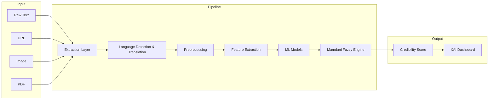

# DeepTruth — Multimodal Fake News Credibility Assessment

> A hybrid **Machine Learning + Mamdani Fuzzy Logic** system that evaluates news credibility across text, URLs, images, and PDFs — with explainable, graded scores instead of rigid binary labels.

[](https://www.python.org/)
[](https://streamlit.io/)
[](https://scikit-learn.org/)
[](https://pythonhosted.org/scikit-fuzzy/)
[](#)

---

## Overview

Misinformation spreads faster than fact-checking can keep up. Most detection tools output a blunt **real/fake** label with little explanation — but credibility in the real world is rarely that simple.

**DeepTruth** addresses this by combining:

- **Multimodal ingestion** — analyze raw text, live URLs, images (OCR), and PDFs
- **Multilingual support** — auto-detect Hindi and other languages, translate to English for unified processing
- **ML perception layer** — TF-IDF + Logistic Regression for clickbait and formality scoring
- **Mamdani fuzzy inference** — 14 rule-based reasoning over 6 linguistic features to produce a **0–100 credibility score**
- **Explainable AI (XAI)** — feature breakdowns, inference logs, and color-coded text highlighting

Built as a **Soft Computing (BITE405L)** work project at **VIT Vellore**.

---

## Features

| Capability | Description |
| --- | --- |
| **Multimodal Input** | Text, URL scraping, image OCR, and PDF parsing in one pipeline |
| **Multilingual** | Devanagari regex detection + Google Translate for Hindi and other languages |
| **Graded Scoring** | Continuous credibility score (Low / Medium / High) instead of binary output |
| **Fuzzy Reasoning** | Mamdani inference with veto rules for uncertain, mixed-signal content |
| **ML-Assisted** | Pre-trained clickbait and formality models on the ISOT Fake News Dataset |
| **Source Awareness** | Domain reputation database blended with per-article formality prediction |
| **XAI Dashboard** | Plotly gauges, feature bar charts, and annotated text highlighting |
| **Lightweight** | Runs on CPU — no GPU required |

---

## Architecture



### Credibility Features

The fuzzy engine evaluates six normalized signals (each in the range `0.0 – 1.0`):

| Feature | What it measures |
| --- | --- |
| **Emotion** | Sentiment polarity intensity (TextBlob) |
| **Objectivity** | Factual vs. subjective tone (TextBlob + VADER) |
| **Source** | Domain reputation + ML formality blend |
| **Clickbait** | ML probability + lexicon heuristic boost |
| **Length** | Content adequacy based on word count |
| **Repetition** | Lexical diversity penalty (spam-like patterns) |

---

## Tech Stack

| Layer | Tools |
| --- | --- |
| **Language** | Python 3.9+ |
| **UI** | Streamlit, Plotly, st-annotated-text |
| **NLP** | TextBlob, NLTK, VADER Sentiment |
| **ML** | scikit-learn (TF-IDF + Logistic Regression) |
| **Fuzzy Logic** | scikit-fuzzy (Mamdani inference) |
| **OCR** | Tesseract (pytesseract), Pillow |
| **Documents** | pdfplumber, newspaper3k |
| **Translation** | langdetect, deep-translator |

---

## Getting Started

### Prerequisites

- **Python 3.9+**
- **Tesseract OCR** installed on your system:
  - macOS: `brew install tesseract tesseract-lang`
  - Ubuntu: `sudo apt install tesseract-ocr tesseract-ocr-hin`
  - Windows: [Tesseract installer](https://github.com/UB-Mannheim/tesseract/wiki)

### Installation

```bash
# Clone the repository
git clone https://github.com/<your-username>/fakenewsproject.git
cd fakenewsproject

# Create and activate a virtual environment (recommended)
python -m venv .venv
source .venv/bin/activate        # macOS / Linux
# .venv\Scripts\activate         # Windows

# Install dependencies
pip install -r requirements.txt

# Download NLTK corpora
python setup_nltk.py
```

### Train ML Models

The app uses pre-trained models stored in `data/clickbait_model.pkl`. To train them from the ISOT dataset:

```bash
# Place ISOT dataset CSVs at:
#   data/extracted_dataset/News _dataset/True.csv
#   data/extracted_dataset/News _dataset/Fake.csv

python train_real_model.py
```

### Run the App

```bash
streamlit run app.py
```

Open **http://localhost:8501** in your browser.

---

## Usage

1. **Select an input mode** from the sidebar — URL Scrape, Raw Text, Image OCR, or PDF Scan.
2. **Submit your content** — paste text, enter a URL, or upload a file.
3. **View results** — the dashboard shows:
   - A **credibility gauge** (0–100) with a Low / Medium / High label
   - **Feature bar chart** showing all six linguistic signals
   - **Inference log** explaining which factors drove the score
   - **XAI text highlighting** — clickbait phrases (pink), extreme emotion (amber), repetitive spam (violet)

### Example: Raw Text

```
Input:  "OMGGG you won't believe this shocking secret! It is totally insane!"
Output: Score ~15/100 — Low credibility
        Flags: High emotional tone, clickbait phrases detected
```

---

## Project Structure

```
fakenewsproject/
├── app.py                  # Streamlit dashboard (main entry point)
├── input_module.py         # Text / URL / Image / PDF extraction
├── language.py             # Language detection & translation
├── preprocessing.py        # Text cleaning & normalization
├── features.py             # Feature engineering (6 credibility signals)
├── ml_models.py            # ML model loader & prediction interface
├── fuzzy_model.py          # Mamdani fuzzy inference engine
├── train_real_model.py     # ISOT dataset training script
├── setup_nltk.py           # NLTK data downloader
├── requirements.txt        # Python dependencies
├── test_pipeline.py        # End-to-end pipeline test
├── data/
│   ├── clickbait_model.pkl # Pre-trained ML models
│   ├── clickbait_words.txt # Lexicon for XAI highlighting
│   └── domain_scores.json  # Known domain reputation scores
└── README.md
```

---

## How It Works

```
Input → Extract Text → Detect Language → Translate → Clean
  → Extract 6 Features → ML Predictions → Fuzzy Rules → Defuzzify
  → Credibility Score + Explanation → Dashboard
```

**Fuzzy rule examples:**

- High emotion **OR** high clickbait → **Low** credibility
- High objectivity **AND** high source **AND NOT** high clickbait → **High** credibility
- High repetition → **Low** credibility
- Mixed signals with medium objectivity → **Medium** credibility

The system uses **centroid defuzzification** to convert overlapping fuzzy memberships into a single crisp score, naturally handling the gray areas that binary classifiers miss.

---

## Testing

```bash
# Run the pipeline sanity test
python test_pipeline.py

# Expected output: "PIPELINE TEST PASSED! Clickbait detected properly."
```

---

## Dataset

Models are trained on a subset of the **[ISOT Fake News Dataset](https://www.impactcybertrust.org/dataset_view?idDataset=23)**:

- 5,000 real articles (`True.csv`) + 5,000 fake articles (`Fake.csv`)
- Title + body text concatenated for richer context
- Two pipelines: clickbait detection and writing formality assessment

---

## Acknowledgments

- ISOT Fake News Dataset for training data
- Open-source libraries: scikit-learn, scikit-fuzzy, Streamlit, Tesseract, and the Python NLP ecosystem

---
